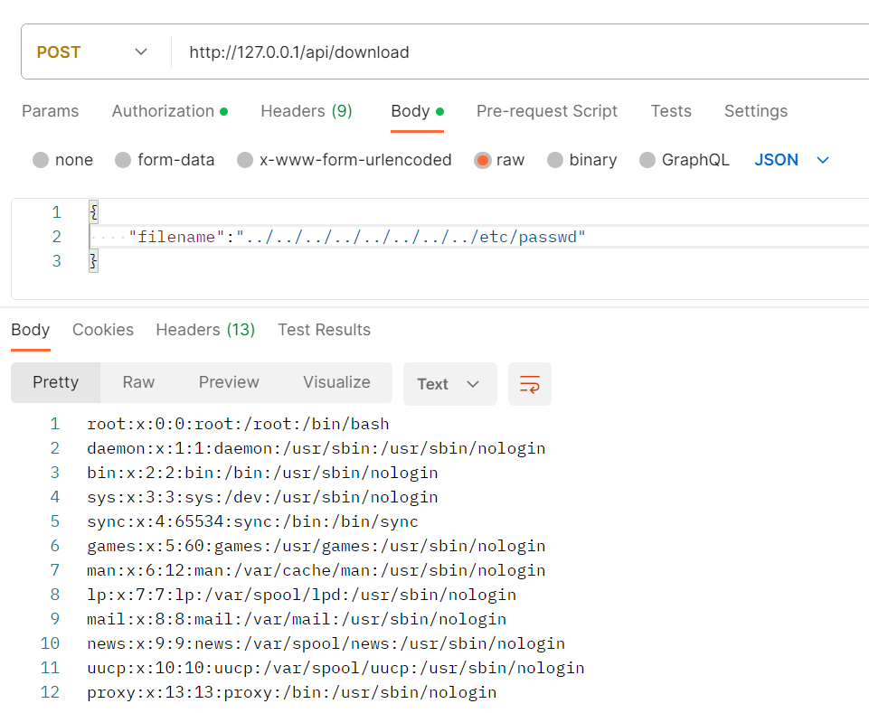
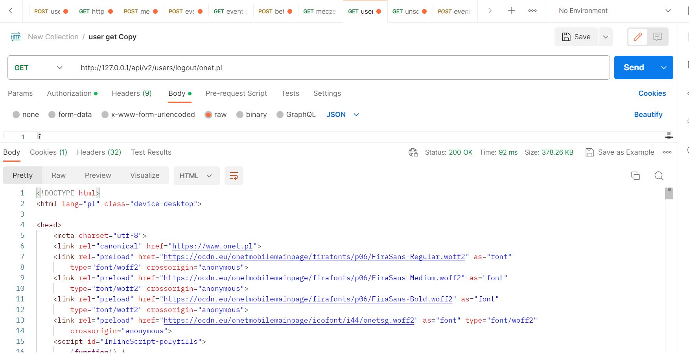
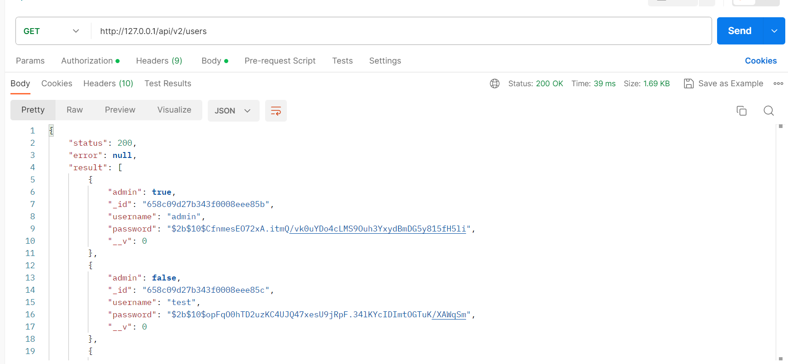
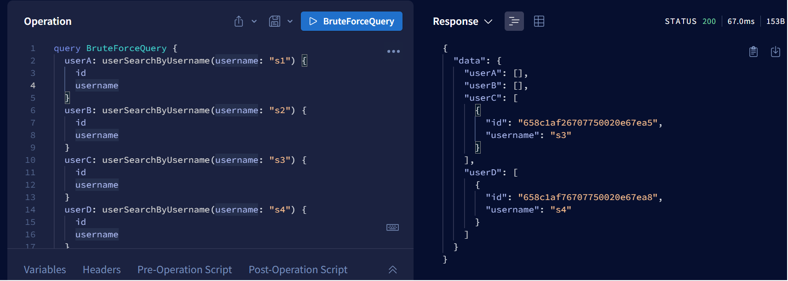

# Path Traversal
**Definicja** - to rodzaj ataku, w którym atakujący próbuję dostać się do plików manipulując ścieżkami. Na przykłąd jeśli aplikacja nie oczyści poprawnie danych wejściowych można za pomocą znaków np. znaków "../" dostać się do wewnętrznych katalogów, które nie powinny być udostępnione.

**Lokalizacja w kodzie** :
```js
        myApp.controller('myCtrl', ['$scope', 'fileUpload','$http', function ($scope, fileUpload,$http) {
            $scope.uploadFile = function () {
                var file = $scope.myFile;
                var uploadUrl = "/api/upload";
                fileUpload.uploadFileToUrl(file, uploadUrl,$scope);

            };

            $scope.downloadFile = function () {
            var post = $http({
                method: "POST",
                url: "/api/download",
                dataType: 'json',
                data: { filename: $scope.name },
                headers: { "Content-Type": "application/json" },
                headers: {'Authorization': 'Bearer ' + localStorage.getItem('JWTSessionID') }
            });
```
**Wady kodu** 



Jak można zauważyć na obrazku wyżej mamy dostęp do prywatnych plików

**Przykład rozwiązania**

1 z rozwiązań jest zamienianie znaków typowych dla ścieżek na np. znaki białe można to uzyskać funkcją **replace(/^(\.\.(\/|\\|$))+/, '')** 
# GraphQL Denial Of Service
**Definicja** - Atak, w którym następuję odmowa usługi, gdzie atakujący wysyłają jedno lub więcej żądań API, co powoduje przeciążenie serwera aplikacji.
Przykładem takiego działania jest - Alias overloading, gdzie w jednym zapytaniu można tworzyć wiele aliasów, przez co dalej będzie jedno zapytanie ale z ogormną ilością danych.\
**Lokalizacja w kodzie** 
```js
    Query: {
      userFindbyId: (parent, args, context, info) => {return User.findById(args.id)}
    }
```
**Wady kodu** - można w łatwy sposób tworzyć aliasy i mnożyć zapytania w jednym żądaniu
np. na takie jedno zapytanie:

```graphql
query {
  user1: userFindbyId(id: "658c13376707750020e67e8c") {
    id
    username
    admin
    token
  }
  user2: userFindbyId(id: "658c13336707750020e67e89") {
    id
    username
    admin
    token
  }
  user3: userFindbyId(id: "658c1af26707750020e67ea5") {
    id
    username
    admin
    token
  }
  user4: userFindbyId(id: "658c1af76707750020e67ea8") {
    id
    username
    admin
    token
  }

  user5: userFindbyId(id: "658c1afd6707750020e67eab") {
    id
    username
    admin
    token
  }
}
```
otrzymamy odpowiedź
```graphql
{
  "data": {
    "user1": {
      "id": "658c13376707750020e67e8c",
      "username": "sss",
      "admin": false,
      "token": null
    },
    "user2": {
      "id": "658c13336707750020e67e89",
      "username": "ss",
      "admin": false,
      "token": null
    },
    "user3": {
      "id": "658c1af26707750020e67ea5",
      "username": "s3",
      "admin": false,
      "token": null
    },
    "user4": {
      "id": "658c1af76707750020e67ea8",
      "username": "s4",
      "admin": false,
      "token": null
    },
    "user5": {
      "id": "658c1afd6707750020e67eab",
      "username": "s5",
      "admin": false,
      "token": null
    }
  }
}
```
**Przykład rozwiązania**

Aby uniknąć przeciążenia serwera należy wyłączyć aliasy lub ustawić je na rozsądną liczbę, ponieważ czasem może być potrzeba skorzystania z nich. Można również ograniczyć długość żądania HTTP.

# Open Redirect
**Definicja** Błąd bezpieczeństwa internetowego, który występuje, gdy aplikacja internetowa przekierowuje użytkownika z jednego adresu URL na inny, bez odpowiedniej weryfikacji celu tego przekierowania.

**Lokalizacja w kodzie** :
```html
      <script>
         document.write(`<a href="/api/v2/users/logout/${document.domain}">Logout</a>`);
      </script>
```
**Wady kodu** po endpoincie możemy dać URL do innej strony i zostaniemy na nią przekierowani



Możemy zauważyć jak tutaj przekierowało nas na stronę onet.pl

**Przykład rozwiązania**

Można zaimplmentować sprawdzanie adresu URL przed przekierowaniem klienta na niego.

# Sensitive Data Exposure
**Definicja** - Sytuacja, w której poufne informacje są dostępne lub eksponowane dla osób nieuprawnionych. Może to obejmować różnego rodzaju dane, takie jak hasła, numery kart kredytowych czy inne dane prywatne.

**Lokalizacja w kodzie** 
```js
   app.controller('MyController', function ($scope, $http, $window) {
        $scope.SendData = function () {
            var post = $http({
                method: "POST",
                url: "/api/v2/login",
                dataType: 'json',
                data: 'username=' + $scope.username +'&' + 'password=' + $scope.password,
                headers: {'Content-Type': 'application/x-www-form-urlencoded'}
            });
 
            post.success(function (data, status) {
                if (data.status == 200) {
                $window.localStorage.setItem('JWTSessionID', data.token);
                window.location = "home.html#" + data.result.username;
                $scope.DataResponse = data.result.username;
                 }
            });
 
            post.error(function (data, status) {
                $scope.DataResponse = data.error;
            });
        }

        $scope.SendData2 = function () {
        var post = $http({
            method: "POST",
            url: "/api/v2/users",
            dataType: 'json',
            data: 'username=' + $scope.username +'&' + 'password=' + $scope.password,
            headers: {'Content-Type': 'application/x-www-form-urlencoded'}
        });


        post.success(function (data, status) {
            if (data.status == 201) {
            $scope.DataResponse = data.user + ' created successfully!';
             } else if (data.status == 409) {
            $scope.DataResponse = data;
             }
        });

        post.error(function (data, status) {
                $scope.DataResponse = data;
            });
        }

    });
```

**Wady kodu** 

Każdy użytkownik ma dostęp do haseł pozostałych użytkowników oraz innych danych, mimo że są one zahashowane nie powinny być publicznie dostępne.

**Przykład rozwiązania**
Stworzenie ról np. ADMIN, USER i ograniczenie dostępu do niektórych endpointów wyłącznie dla admina.

# GraphQL Batching Brute Force
**Definicja** - Mechanizm, który umożliwia jednoczesne wykonywanie wielu zapytań w jednym żądaniu HTTP. Można w jednym zapytaniu sprawdzić wszystkie kombinacje danego parametru, który jest możliwy do sprawdzenia np. nazwy użytkownika

**Lokalizacja w kodzie** 
```js
    Query: {
    userSearchByUsername: async (parent, args, context, info) => {
      user = args.username;
      result = await User.find({ username: user }, '_id username admin').exec();
      return result;
  },
```
**Wady kodu**


W teoretycznie jednym zapytaniu można sprawdzić wszytskie kombinację które chcemy i np znaleźć listę wszystkich użytkowników.

**Przykład rozwiązania**
Stworzenie ograniczenia aliasów lub długości zapytania (podobnie jak w GraphQL Denial Of Service).